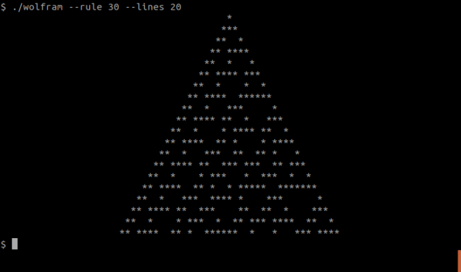
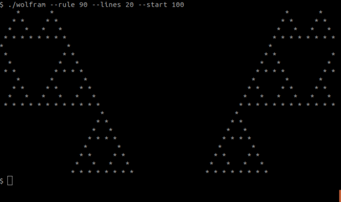
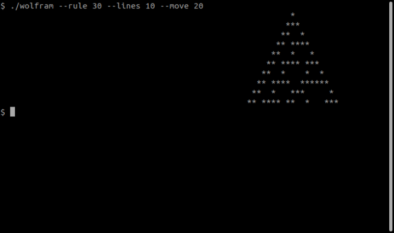

# Wolfram

The goal of this project is to implement Wolfram’s elementary cellular automaton in the terminal.

https://en.wikipedia.org/wiki/Elementary_cellular_automaton

You only have to implement rule 30, rule 90 and rule 110. The other rules are considered a bonus.

The space your cellular automaton are living in is infinite (to the left, right, and bottom).
This means the parts not shown on screen can still have an effect on future generations.

# Usage:

> $ ./wolfram --rule x --lines y

Your program must support the following options:

- rule : the ruleset to use (no default value, mandatory)
- start : the generation number at which to start the display. The default value is 0.
- lines : the number of lines to display. When omitted, the program never stops.
- window : the number of cells to display on each line (line width). If even, the central cell is displayed in the next cell on the right. The default value is 80.
- move : a translation to apply on the window. If negative, the window is translated to the left. If positive, it’s translated to the right.

If no option or invalid options are provided your program must return 84 and display a usage message (eventually accompagned with an explicite error message of your choice)

# Exemples:

# Note:

Epitech Moulinette: 88%

01. Basics - 100% - 1/1
02. Rule 30 - 100% - 3/3
03. Rule 90 - 100% - 3/3
04. Rule 110 - 100% - 3/3
05. Infinite - 100% - 1/1
06. Window and move - 50% - 1/2
07. Performance - 100% - 3/3
08. Error handling - 60% - 3/5
09. Coding Style - 100 - 4/4